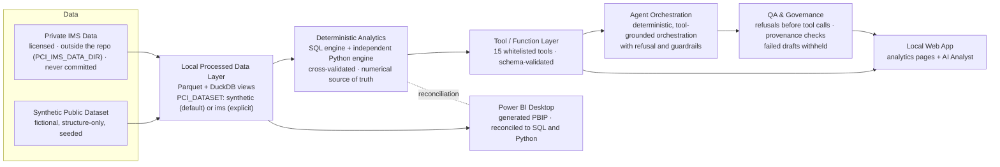

# Pharma Commercial Intelligence & Brand Growth Engine

A governed commercial-analytics product for pharmaceutical secondary-sales data. Deterministic SQL and Python engines compute every number, and the rest of the product sits on top of them: an explainable opportunity score, a what-if scenario engine, a local web application, a function-calling agent layer with QA, and a Power BI layer reconciled to the engines.

> **Data.** The project was built on a licensed, proprietary national pharma secondary-sales audit that is **not** included. Everything public runs on a **fictional, structure-only synthetic dataset** with the same schema, generated locally in about 1 second. Synthetic results describe an invented market, not real sales. See `docs/SYNTHETIC_DATA.md`.

## What it demonstrates
| Capability | How | Evidence |
|---|---|---|
| Reproducible commercial metrics | Month / calendar-YTD / MAT windows; growth that is BLANK (never 0) without a comparison base; share, contribution and evolution index; deterministic ranks | `sql/metrics.sql`, 176 SQL tests |
| Independent verification | A second, pure-Python engine is cross-checked field by field against SQL | 80 SQL = Python parity tests |
| Explainable opportunity score | OPP-1.0.0: percentile evidence (market growth, relative momentum, market position); insufficient evidence is a status, never a zero | `docs/OPPORTUNITY_SCORING.md`, pinned fingerprint |
| What-if scenarios (not forecasts) | SCN-1.0.0: price/volume, market growth and share scenarios with explicit, validated assumptions | `docs/SCENARIO_ENGINE.md`, 10 fault injections |
| Governed agentic AI | Orchestrator plus specialist agents that reach data only through a permissioned tool registry; QA withholds any answer whose numbers don't trace to tool results | 75-case evaluation at 100%; 334/334 values traced |
| Optional LLM | `LLM_PROVIDER=GEMINI` routes requests on synthetic data only; tools compute and templates write the answer, so the model cannot introduce a metric | 11 mocked-model tests; live run **partial** (2/26 cases, free-tier quota) |
| Product UI | 8-area local web app: a source footer on every panel, an evidence drawer for opportunity details, all loading/empty/error/insufficient states, and a synthetic-data indicator | `docs/UI_UX_ARCHITECTURE.md` |
| Power BI | Generated project (TMDL model + PBIR report, 9 pages), reconciled to the engines | 83/83 cases on private and synthetic data; 88/88 visual queries |
| Public-data safety | Structure-only generator that reads no data file; leakage tests; publication guards | 19 leakage tests, `tests/test_publication_m14.py` |

**Principle:** agents route and explain; deterministic, tested functions calculate every business number.

## System Architecture
Deterministic, tool-grounded orchestration with refusal and guardrails: the analytics engines are the numerical source of truth, agents reach them only through whitelisted tools, and deterministic QA withholds any answer it cannot trace to a tool result. Everything runs locally; the public workflow uses the synthetic dataset.



- [Full Architecture](docs/ARCHITECTURE_FLOW.md) (layers, components, private/synthetic boundary, Power BI path)
- [Executive Flow](docs/EXECUTIVE_FLOW.mmd)
- [Agentic AI Flow](docs/AGENTIC_AI_FLOW.mmd)

## Quickstart (public mode: synthetic data, Windows, Python 3.13)
**Default = synthetic data.** The public quickstart needs no IMS data and no private configuration: with
`PCI_DATASET` unset the application uses the fictional, structure-only dataset in `data/synthetic/`.
```
python -m venv .venv && .venv\Scripts\pip install -r requirements.txt
cd python && ..\.venv\Scripts\python.exe -m pci_synthetic.generate && cd ..
.venv\Scripts\python.exe run_app.py --port 8766      # http://127.0.0.1:8766 (local only, offline)
```
Public mode never searches for data: it reads only `data/synthetic/`, binds to 127.0.0.1, accepts only local
`Host`/`Origin` headers, caps every result list and makes no network call (no language model unless you opt in
to the synthetic-only Gemini router, `docs/GEMINI_VALIDATION.md`).

Tests (public mode):
```
.venv\Scripts\python.exe scripts\run_tests_by_file.py
```
Tests that assert facts of the licensed dataset carry the `ims` marker and are skipped in public mode; the synthetic,
isolation, security, UI, agent-boundary and publication suites run anywhere.

## Private local development (licensed IMS data — owner only)
> **PRIVATE IMS DATA MUST NEVER BE COMMITTED, PUSHED, UPLOADED, SCREENSHOTTED OR SENT TO ANY EXTERNAL SERVICE.**

Private mode is opt-in and needs two explicit settings; nothing is discovered automatically:
```
set PCI_DATASET=ims
set PCI_IMS_DATA_DIR=<PRIVATE_EXTERNAL_DIRECTORY>
```
- `PCI_IMS_DATA_DIR` must be an existing absolute directory **outside** this repository (not inside it, not a parent
  of it, not reached through a link into it, not inside any git work tree, not a drive root). Otherwise the
  application refuses to start; it never falls back to synthetic data, and synthetic mode never falls back to IMS.
- Every IMS-derived output (processed layer, Power BI exports, reconciliation and evaluation reports, profiles,
  caches, test logs) is written under `PCI_IMS_DATA_DIR`, never into the repository.
- External language models are refused in IMS mode (Gemini runs on synthetic data only).
- Rebuild the processed layer from the workbook (the workbook must also be outside the repository):
  `set PCI_SOURCE_PATH=<PRIVATE_WORKBOOK_PATH>` then `cd python && ..\.venv\Scripts\python.exe -m pci_data.build_processed`.
- Before committing or pushing, enable the publication guard once per clone: `git config core.hooksPath .githooks`
  (`docs/PUBLICATION_GUARD.md`). It blocks data files, private locations, secrets, drive paths and private history.

Details: `SECURITY.md` and `docs/DATA_ISOLATION.md`.

- Walkthrough: `DEMO_GUIDE.md`.
- Power BI on synthetic data: `docs/POWER_BI_ARCHITECTURE.md` §11b.

## Results at a glance
All results as of 2026-09-27. Details are in `EVALUATION_RESULTS.md` and `docs/FINAL_AUDIT.md`.
- **Tests:** 886 passed, 0 failed, 0 skipped (private + synthetic suites, per-file run).
- **Power BI reconciliation:**
  - private data: 83/83 cases, 5,195,694 values, max relative difference 2.9e-11;
  - synthetic data: 83/83.
- **Agent evaluation:** routing, tool selection, QA pass/block and numeric provenance all at 100% on the 75-case M10 suite.
- **Partial:** live Gemini evaluation. 2/26 cases were executed on the free tier and both passed; 24 were blocked by the daily quota, including every refusal and adversarial case (docs/GEMINI_VALIDATION.md).
- **UI restyle:** Google Stitch was used as a visual reference only; Antigravity implemented a CSS-only restyle (`app/web/style.css`; no markup, logic, metric or test changes). Antigravity reported five-width browser QA (1440/1366/1024/768/375) to the owner; Claude's independent check was a partial smoke test (synthetic data: Overview at desktop width, Scenario and AI Analyst at 375 px; no horizontal scroll, no console errors, local requests only).

## Documentation
| Topic | Document |
|---|---|
| Case study (consulting style) | `docs/CASE_STUDY.md` · slide spec `docs/EXECUTIVE_CASE_STUDY_SLIDES.md` |
| CV evidence (claims → proof) | `docs/CV_EVIDENCE.md` |
| Demo script | `DEMO_GUIDE.md` |
| Architecture | `docs/ARCHITECTURE_FLOW.md` (diagrams), `ARCHITECTURE.md`, `docs/AGENTIC_ARCHITECTURE.md`, `docs/POWER_BI_ARCHITECTURE.md` |
| Data | `DATA_DICTIONARY.md`, `DATA_PROVENANCE.md`, `docs/DATA_MODEL.md`, `docs/SYNTHETIC_DATA.md` |
| Methods | `ANALYTICS_METHODS.md`, `docs/MARKET_DEFINITION.md`, `docs/OPPORTUNITY_SCORING.md`, `docs/SCENARIO_ENGINE.md` |
| Evaluation | `EVALUATION_PLAN.md`, `EVALUATION_RESULTS.md`, `docs/EVALUATION_METHODOLOGY.md`, `docs/GEMINI_VALIDATION.md` |
| Security & publication | `SECURITY.md`, `docs/PUBLICATION_READINESS.md` |
| Audit & status | `docs/FINAL_AUDIT.md`, `PROJECT_STATUS.md`, `IMPLEMENTATION_PLAN.md` |

## Repository map
| Path | Purpose |
|---|---|
| `python/pci_data/`, `sql/` | Processed-layer build (private source → Parquet), dataset switch, DuckDB views and SQL metric engine |
| `python/pci_analytics/` | Analytics API, independent Python engine, opportunity scoring, scenario engine, data-quality status |
| `python/pci_app/`, `app/web/`, `run_app.py` | Whitelisted tool API, local server, web UI |
| `python/pci_agents/`, `python/pci_llm_providers/` | Governed agents, QA, provider interface; optional Gemini provider |
| `python/pci_eval/`, `python/pci_llm_eval/` | M10 evaluation harness; Gemini contract-validation package |
| `python/pci_powerbi/`, `dashboards/` | Power BI project generator, export, local reconciliation; generated PBIP |
| `python/pci_synthetic/`, `data/synthetic/SYNTHETIC_FINGERPRINT.json` | Synthetic dataset generator and fingerprint |
| `python/profiling/` | Read-only profiling scripts for the private source (private use only; they also need `pandas` and `numpy`, which are not in `requirements.txt`) |
| `scripts/` | Per-file test runner, metric traces |
| `tests/` | 886 tests across data, SQL, Python, parity, scoring, scenarios, app, agents, UI, Power BI, synthetic, publication |

## Limitations
- National data only (no geography, channel, prescriber or promotion data).
- The units scale is inferred; value in ₹ crore is confirmed.
- Opportunity weights are documented assumptions, not estimates.
- Scenarios are arithmetic, not forecasts.
- The default AI mode is a deterministic grammar; a real LLM is opt-in.

This is a portfolio project. It makes no claim of client or employer impact.
