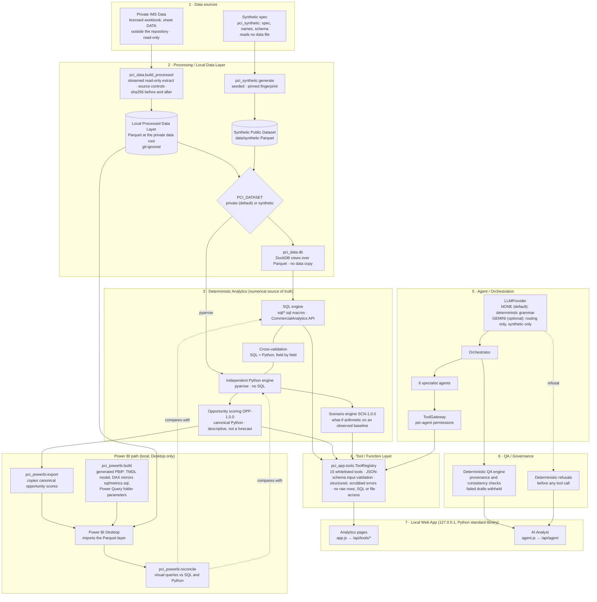
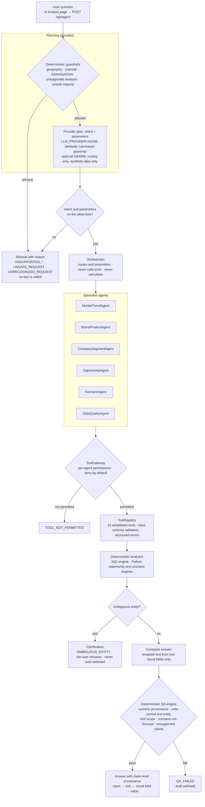

# Architecture flow

How a number travels from the data to the screen. Every box below maps to code in this repository. The system runs locally, with no cloud services. The public workflow uses the **synthetic dataset** only.

Diagram sources (Mermaid): [full architecture](ARCHITECTURE_FLOW.mmd) · [executive flow](EXECUTIVE_FLOW.mmd) · [agentic AI flow](AGENTIC_AI_FLOW.mmd).

## Full architecture

## Layers

| # | Layer | What it does | Code |
|---|---|---|---|
| 1 | Data sources | **Private IMS Data**: a licensed secondary-sales workbook. It stays outside the repository, is opened read-only and is never committed; its location is set locally with `PCI_SOURCE_PATH` (placeholder `<PRIVATE_WORKBOOK_PATH>`). **Synthetic Public Dataset**: fictional, structure-only data generated from a committed spec that reads no data file. | `python/pci_data/schema.py`, `python/pci_synthetic/` |
| 2 | Processing / Local Data Layer | A one-time streamed extract writes the private Parquet layer (git-ignored, under `<PRIVATE_DATA_ROOT>`) with source-side control totals and a source sha256 checked before and after. `PCI_DATASET` selects the private (default) or synthetic layer; DuckDB serves views over the Parquet files without copying data. | `python/pci_data/build_processed.py`, `python/pci_data/db.py`, `sql/views.sql` |
| 3 | Deterministic Analytics | The **numerical source of truth**. SQL macros compute every metric; an independent Python engine re-implements them without SQL, and a cross-validation framework checks the two field by field. Opportunity scoring and scenarios exist only in Python. The score is descriptive (not a forecast); scenarios are what-if arithmetic on an observed baseline. | `sql/`, `python/pci_analytics/` |
| 4 | Tool / Function Layer | `ToolRegistry`: 15 whitelisted tools with input contracts, validated before any engine call, and structured errors with paths scrubbed. There are no endpoints for raw rows, SQL, code execution or files. | `python/pci_app/tools.py` |
| 5 | Agent / Orchestration | The provider plans intent + parameters. The orchestrator routes to specialist agents, which reach tools only through the `ToolGateway` (per-agent permissions, deny by default). The orchestrator never calls tools or calculates. | `python/pci_agents/` |
| 6 | QA / Governance | Deterministic refusals happen before any tool call. The QA engine validates every draft (numeric provenance, units, period/entity consistency, tool scope, scenario-not-forecast, unsupported claims, disambiguation, …); a failing draft is withheld as `QA_FAILED`. | `python/pci_agents/parser.py`, `python/pci_agents/qa.py` |
| 7 | Web App | Local server on 127.0.0.1 (Python standard library). Analytics pages call only `/api/tools/*`; the AI Analyst calls only `/api/agent`. No external assets; synthetic-data badge. | `python/pci_app/server.py`, `app/web/` |
| — | Power BI | Canonical opportunity scores are exported to Parquet; a generator writes the PBIP (TMDL model whose DAX mirrors `sql/metrics.sql`, Power Query folder parameters, report). Power BI Desktop runs locally; `reconcile` compares its visual queries with the SQL and Python engines. Scores are imported, never recomputed in DAX. | `python/pci_powerbi/`, `dashboards/` |

## Agents and their tools

Permissions come from `python/pci_agents/gateway.py`. The orchestrator and the QA engine hold no tools.

| Agent | Tools it may call |
|---|---|
| MarketTrendAgent | `get_market_performance`, `get_market_trends` |
| BrandProductAgent | `find_products`, `get_brand_performance`, `get_brand_growth`, `get_brand_share` |
| CompanySegmentAgent | `get_company_performance`, `get_therapy_performance`, `get_segment_analysis` |
| OpportunityAgent | `get_opportunity_scores`, `get_opportunity_detail` |
| ScenarioAgent | `get_scenario_baseline`, `run_scenario` |
| DataQualityAgent | `get_data_quality_status` |

The web pages also call `get_application_metadata`, the 15th tool.

## Agentic AI flow

Deterministic, tool-grounded orchestration with refusal and guardrails. Source: [AGENTIC_AI_FLOW.mmd](AGENTIC_AI_FLOW.mmd).

**Guardrails in the code:**
- **Refused before any tool call:** geography, channel, SSA/HSA/DSA splits (their meaning is unconfirmed), unsupported analyses (forecasting, elasticity, prescribers, promotions) and unsafe requests (instruction overrides, code, SQL, file or raw-data access).
- **Parameters:** checked against per-intent allow-lists.
- **Tool access:** agents are limited to their own tools (above).
- **Ambiguous products:** the user must choose; nothing is auto-selected.
- **Answer text:** composed from tool fields.
- **QA:** checks every number against a tool result before release.

**Optional Gemini provider (`LLM_PROVIDER=GEMINI`):**
- **What it does:** proposes intent and parameters only; it never writes numbers or answer text.
- **Restrictions:** requires `PCI_DATASET=synthetic` and an API key from the environment. Deterministic refusals run before the model is asked.
- **Default:** `NONE` (deterministic demo mode, no network).
- **Live evaluation:** **partial** (2 of 26 cases completed on the free tier; see [GEMINI_VALIDATION.md](GEMINI_VALIDATION.md)).

## Private vs synthetic boundary

| | Private | Synthetic (public) |
|---|---|---|
| Source | Licensed workbook at `<PRIVATE_WORKBOOK_PATH>` (never in the repository) | Committed spec and generator; no data file read |
| Processed layer | Parquet under `<PRIVATE_DATA_ROOT>` (git-ignored) | `data/synthetic/` (regenerated, fingerprint pinned by tests) |
| Selected by | `PCI_DATASET` unset or `private` | `PCI_DATASET=synthetic` |
| External model (Gemini) | Not allowed: the provider refuses to start and the app falls back to deterministic mode | Allowed, routing only |
| Published | Schema, methodology, value-free quality metadata | Code, fingerprint, synthetic evaluation outputs |

## Related documents
[ARCHITECTURE.md](../ARCHITECTURE.md) · [AGENTIC_ARCHITECTURE.md](AGENTIC_ARCHITECTURE.md) · [TOOL_API.md](TOOL_API.md) · [DATA_PIPELINE.md](DATA_PIPELINE.md) · [SQL_ANALYTICS.md](SQL_ANALYTICS.md) · [PYTHON_ANALYTICS.md](PYTHON_ANALYTICS.md) · [OPPORTUNITY_SCORING.md](OPPORTUNITY_SCORING.md) · [SCENARIO_ENGINE.md](SCENARIO_ENGINE.md) · [POWER_BI_ARCHITECTURE.md](POWER_BI_ARCHITECTURE.md) · [SYNTHETIC_DATA.md](SYNTHETIC_DATA.md) · [GEMINI_VALIDATION.md](GEMINI_VALIDATION.md)
